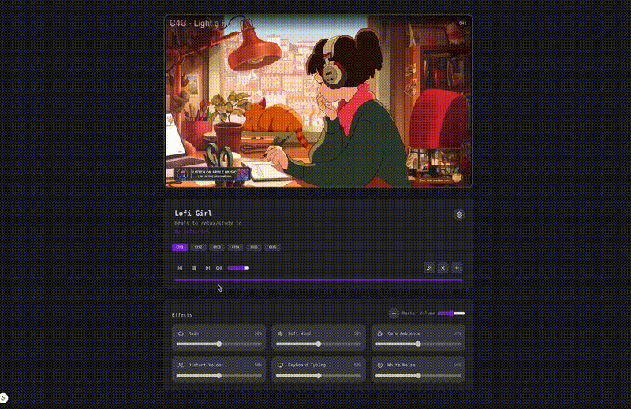

# 🎵 NextBeats

A modern, customizable lofi music player built with Next.js and TypeScript. Perfect for coding, studying, or just chilling.

<p align="center">
  
</p>

## ✨ Features

- 🎨 Beautiful retro TV-style interface
- 🎬 YouTube integration for endless lofi streams
- 🎛️ Multiple sound effects to enhance your experience
- 🌈 Theme customization
- 📻 Channel management (add, edit, delete custom channels)
- 🎚️ Independent volume controls for music and effects
- 💾 Persistent settings with localStorage
- 📱 Responsive design for all devices

## 🚀 Getting Started

### Prerequisites

- Node.js (v16 or higher)
- npm or yarn

### Installation

1. Clone the repository:

```bash
git clone https://github.com/yourusername/next-beats.git
cd next-beats
```

2. Install dependencies:

```bash
npm install
# or
yarn install
```

3. Run the development server:

```bash
npm run dev
# or
yarn dev
```

4. Open [http://localhost:3000](http://localhost:3000) in your browser to start vibing! 🎧

## 🎮 Usage

- **Channel Navigation**: Use the channel buttons to switch between different lofi streams
- **Sound Effects**: Toggle various ambient sounds (rain, cafe, birds, etc.) to create your perfect atmosphere
- **Volume Control**: Adjust both music and effects volume independently
- **Custom Channels**: Add your own favorite lofi YouTube streams
- **Theme Customization**: Switch between different visual themes

## 🛠️ Built With

- [Next.js](https://nextjs.org/) - React framework
- [TypeScript](https://www.typescriptlang.org/) - For type safety
- [Tailwind CSS](https://tailwindcss.com/) - For styling
- [React Player](https://github.com/cookpete/react-player) - For YouTube playback

## 🤝 Contributing

Contributions are what make the open source community amazing! Any contributions you make are **greatly appreciated**.

1. Fork the Project
2. Create your Feature Branch (`git checkout -b feature/AmazingFeature`)
3. Commit your Changes (`git commit -m 'Add some AmazingFeature'`)
4. Push to the Branch (`git push origin feature/AmazingFeature`)
5. Open a Pull Request

## 📝 License

This project is licensed under the MIT License - see the [LICENSE](LICENSE) file for details.

## 🙏 Acknowledgments

- All the amazing lofi music creators
- The open source community
- Coffee ☕

---

Made with ❤️ by [Your Name]
